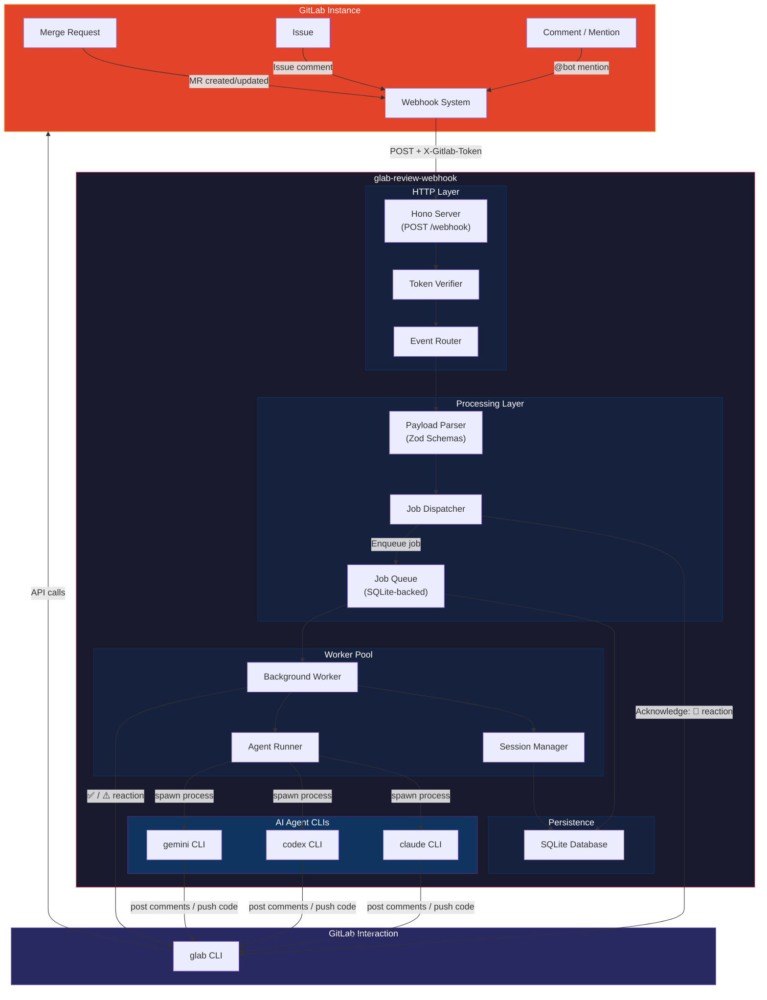
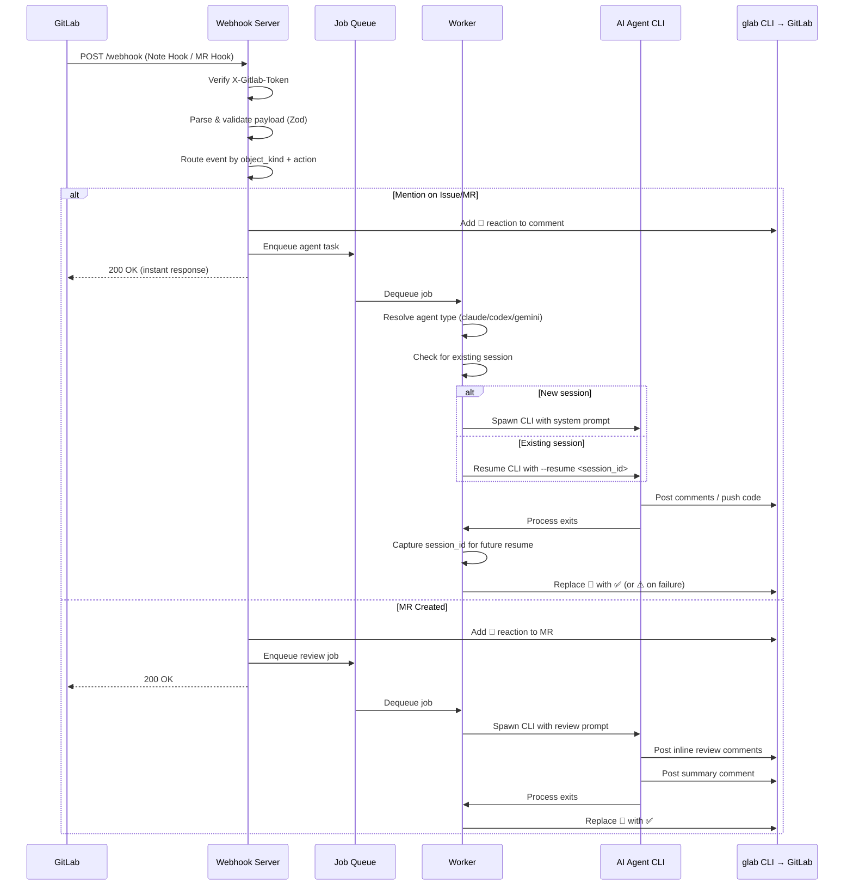
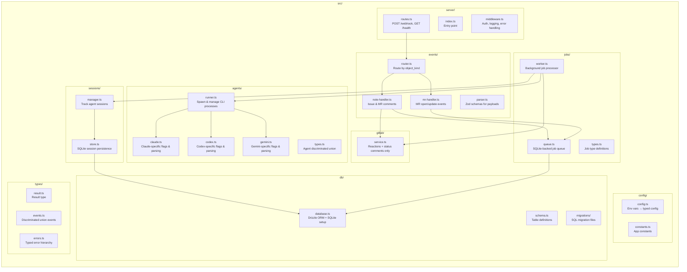

# Service Architecture Plan

> **glab-review-webhook** — A GitLab webhook service that orchestrates AI coding agents for automated code reviews and issue resolution.

---

## Table of Contents

1. [Feature Checklist](#1-feature-checklist)
2. [Architecture Diagram](#2-architecture-diagram)
3. [Tech Stack](#3-tech-stack)
4. [Component Design](#4-component-design)
5. [Data Flow](#5-data-flow)
6. [Closed-Loop System Design](#6-closed-loop-system-design)
7. [GitLab Integration Reference](#7-gitlab-integration-reference)
8. [Configuration](#8-configuration)

---

## 1. Feature Checklist

### Journey 1: Issue Mention → AI Agent Task

- [ ] **F1.1** Receive GitLab `Note Hook` webhooks (comments on issues)
- [ ] **F1.2** Verify webhook secret (`X-Gitlab-Token` header)
- [ ] **F1.3** Parse `@bot-username` mentions from `object_attributes.note`
- [ ] **F1.4** Instantly add "eyes" (👀) emoji reaction to acknowledge the comment
- [ ] **F1.5** Parse agent selector from mention prefix (e.g., `@bot codex fix this`, `@bot fix this`, `@bot review`)
- [ ] **F1.6** Enqueue background job with: agent type, issue context, comment text, project info
- [ ] **F1.7** Spawn AI agent CLI (`claude`, `codex`, or `gemini`) in background worker
- [ ] **F1.8** Provide system instructions to agent (non-interactive mode, use GitLab CLI for output)
- [ ] **F1.9** Agent posts results back as GitLab issue comment via `glab`
- [ ] **F1.10** Replace "eyes" reaction with "white_check_mark" (✅) on completion, or "warning" (⚠️) on failure

### Journey 2: Session Continuity (Follow-up Replies)

- [ ] **F2.1** Detect when a reply is directed at the bot (in same thread or new mention)
- [ ] **F2.2** Look up existing agent session for the issue/thread
- [ ] **F2.3** Resume agent session with `--resume <session_id>` (Claude) or equivalent
- [ ] **F2.4** Pass the new comment as follow-up prompt to the resumed session
- [ ] **F2.5** Track session state in database (session_id, agent_type, issue/MR context, status)

### Journey 3: Merge Request Auto-Review

- [ ] **F3.1** Receive GitLab `Merge Request Hook` webhooks (action: `open`)
- [ ] **F3.2** Instantly add "eyes" emoji to the MR to signal review in progress
- [ ] **F3.3** Enqueue review job: clone repo, checkout MR branch, run AI review
- [ ] **F3.4** Agent analyzes diff and posts inline review comments via `glab api` (Discussions API)
- [ ] **F3.5** Post summary comment on the MR with overall review assessment
- [ ] **F3.6** Replace "eyes" with "white_check_mark" on completion

### Journey 4: MR Review Interaction

- [ ] **F4.1** Receive `Note Hook` on MR comments mentioning the bot
- [ ] **F4.2** Parse directive: fix suggestion, re-review, apply change
- [ ] **F4.3** Resume review session or start new one based on context
- [ ] **F4.4** Agent can push commits to the MR source branch if requested
- [ ] **F4.5** Re-review triggered by user after new commits (via mention)

### Journey 5: Webhook Infrastructure

- [ ] **F5.1** HTTP server with health check endpoint (`GET /health`)
- [ ] **F5.2** Webhook endpoint (`POST /webhook`)
- [ ] **F5.3** Secret token verification on every request
- [ ] **F5.4** Request ID logging (`X-Gitlab-Webhook-UUID`)
- [ ] **F5.5** Idempotency check (prevent duplicate processing via `Idempotency-Key`)
- [ ] **F5.6** Graceful shutdown (wait for in-flight jobs to complete)
- [ ] **F5.7** Structured JSON logging
- [ ] **F5.8** Error reporting with context (project, MR/issue ID, event type)

---

## 2. Architecture Diagram

### High-Level System Overview



### Event Processing Flow



### Component Architecture



---

## 3. Tech Stack

### Runtime & Language

| Component | Choice | Rationale |
|-----------|--------|-----------|
| **Runtime** | Bun | Native TypeScript, fast startup, built-in test runner, built-in SQLite |
| **Language** | TypeScript (strict) | Strong type system for closed-loop AI development |
| **Package Manager** | Bun | Built-in, fast, lockfile by default |

### Dependencies (Minimal Set)

| Category | Package | Purpose |
|----------|---------|---------|
| **Web Framework** | `hono` | Lightweight, type-safe, works natively with Bun |
| **Validation** | `zod` | Runtime validation of webhook payloads with TypeScript inference |
| **Database ORM** | `drizzle-orm` + `drizzle-kit` | Type-safe SQL, SQLite support, migration tooling |
| **SQLite Driver** | `bun:sqlite` (built-in) | Zero-dependency SQLite via Bun's native module |
| **Result Type** | `neverthrow` | Enforce Result-based error handling, no thrown exceptions |
| **Logging** | `pino` | Structured JSON logging, fast |
| **Process Management** | `node:child_process` / `Bun.spawn` | Spawn AI CLI processes |

### Dev Dependencies

| Category | Package | Purpose |
|----------|---------|---------|
| **Linter + Formatter** | `@biomejs/biome` | Single tool for both, fast, strict, no config sprawl |
| **Test Runner** | `bun:test` (built-in) | Native test runner, no extra dependency |
| **Git Hooks** | `lefthook` | Fast, no Node dependency, single config file |
| **Type Checking** | `typescript` | `tsc --noEmit` for type checking only (Bun handles execution) |

### Why These Choices

1. **Bun over Node.js**: Native TypeScript execution (no build step), built-in SQLite (no native addon compilation), built-in test runner, faster startup for CLI-heavy workloads.

2. **Hono over Express/Fastify**: Type-safe by design, minimal footprint, first-class Bun support, middleware composition pattern matches our event routing needs.

3. **Biome over ESLint + Prettier**: Single tool replaces two, 10-100x faster, stricter defaults, zero plugins needed. Eliminates the "which ESLint config" ambiguity for AI agents.

4. **Drizzle over Prisma/TypeORM**: SQL-first (agents can reason about the actual queries), type-safe without code generation, lightweight, works with Bun's built-in SQLite.

5. **neverthrow over try/catch**: Forces explicit error handling at every call site. AI agents cannot accidentally ignore errors. The type system ensures every `Result` is checked.

6. **lefthook over husky**: No Node.js dependency for the hook runner itself, single YAML config file, parallel hook execution.

---

## 4. Component Design

### 4.1 Event Router — Discriminated Union Pattern

Every webhook event is modeled as a discriminated union. There is exactly **one path** from webhook receipt to handler.

```typescript
// src/types/events.ts

type WebhookEvent =
  | { kind: "note_on_issue"; payload: NoteOnIssuePayload }
  | { kind: "note_on_mr"; payload: NoteOnMRPayload }
  | { kind: "mr_opened"; payload: MergeRequestPayload }
  | { kind: "mr_updated"; payload: MergeRequestPayload }
  | { kind: "ignored"; reason: string };

// Exhaustive routing — compiler error if a case is unhandled
function routeEvent(event: WebhookEvent): Result<JobId | null, AppError> {
  switch (event.kind) {
    case "note_on_issue":
      return handleNoteOnIssue(event.payload);
    case "note_on_mr":
      return handleNoteOnMR(event.payload);
    case "mr_opened":
      return handleMROpened(event.payload);
    case "mr_updated":
      return handleMRUpdated(event.payload);
    case "ignored":
      return ok(null);
    // No default — TypeScript enforces exhaustiveness
  }
}
```

### 4.2 Webhook Payload Validation — Zod Schemas

```typescript
// src/events/parser.ts

const NoteHookPayload = z.object({
  object_kind: z.literal("note"),
  user: z.object({
    id: z.number(),
    username: z.string(),
    name: z.string(),
  }),
  project: z.object({
    id: z.number(),
    path_with_namespace: z.string(),
    web_url: z.string(),
    default_branch: z.string(),
  }),
  object_attributes: z.object({
    id: z.number(),
    note: z.string(),
    noteable_type: z.enum(["Issue", "MergeRequest", "Commit", "Snippet"]),
    noteable_id: z.number(),
    action: z.enum(["create", "update"]),
    url: z.string(),
    system: z.boolean(),
  }),
  issue: IssueSchema.optional(),
  merge_request: MergeRequestSchema.optional(),
});

// Parse with Result type — never throws
function parseWebhookPayload(
  eventType: string,
  body: unknown
): Result<WebhookEvent, ParseError> {
  // ...
}
```

### 4.3 Agent Runner — Process Spawning

Modeled after vibe-kanban's executor pattern, adapted for simplicity:

```typescript
// src/agents/runner.ts

interface AgentConfig {
  readonly agent: AgentType;
  readonly workDir: string;
  readonly prompt: string;
  readonly sessionId?: string;     // For resume
  readonly systemPrompt: string;   // Non-interactive instructions
  readonly env: Record<string, string>;
}

interface AgentResult {
  readonly exitCode: number;
  readonly sessionId: string | null;
  readonly stdout: string;
  readonly stderr: string;
  readonly durationMs: number;
}

// Each agent implements this interface — one spawn method, one shape
interface AgentExecutor {
  spawn(config: AgentConfig): Promise<Result<AgentProcess, AgentError>>;
  buildArgs(config: AgentConfig): readonly string[];
  parseSessionId(stdout: string): string | null;
}

// Discriminated union for agent types
type AgentType =
  | { kind: "claude" }
  | { kind: "codex" }
  | { kind: "gemini" };
```

### 4.4 Agent Non-Interactive Mode & System Prompts

Spawned agents run **autonomously** — there is no user at the terminal. Each CLI tool handles non-interactive mode differently:

| Agent | Non-Interactive Flag | Skip Permissions | System Prompt Delivery | Session Resume |
|-------|---------------------|-------------------|----------------------|----------------|
| **Claude** | `--print` (`-p`) | `--dangerously-skip-permissions` or `--allowedTools` | `--append-system-prompt` flag | `--resume <session-id>` |
| **Codex** | `codex exec` subcommand | `--full-auto` or `--yolo` | `AGENTS.md` file or `--config developer_instructions=` | `codex exec resume <session-id>` |
| **Gemini** | `--prompt` (`-p`) | `--yolo` | `GEMINI_SYSTEM_MD` env var + `GEMINI.md` file | No headless resume support |

#### System Prompt Template (Common to All Agents)

Every agent receives these non-negotiable instructions:

```
You are an autonomous AI coding agent running in non-interactive mode.
There is NO user at the terminal. Do NOT wait for user input or approval.
You MUST make all decisions independently.

## Communication
- Post ALL output as GitLab comments using `glab` CLI.
- NEVER print to stdout expecting a human to read it.
- If you need to explain your reasoning, include it in the GitLab comment.
- If you are uncertain, explain your uncertainty in the comment — do not ask and wait.

## Context
- Project: {project_path}
- {context_type}: {context_id} (e.g., "Issue: #42" or "MR: !123")
- Triggering message: {user_comment}

## Tools
- Use `glab` CLI for ALL GitLab interaction (non-interactive flags only).
- Use `git` for repository operations.
- Do NOT use interactive commands (no editors, no pagers, no prompts).
- Always pass `--repo {project_path}` to glab commands when needed.

## Safety
- Create feature branches for code changes. NEVER push to protected branches.
- Do NOT modify CI/CD configuration unless explicitly asked.
- Do NOT delete branches, tags, or releases.

## Completion
- When done, post a summary comment on the issue/MR.
- If you cannot complete the task, post a comment explaining why.
```

#### Adapter-Specific Invocations

```bash
# Claude
claude -p \
  --dangerously-skip-permissions \
  --model sonnet \
  --output-format stream-json \
  --max-turns 50 \
  --append-system-prompt "$SYSTEM_PROMPT" \
  "$USER_MESSAGE"

# Claude resume
claude -p \
  --dangerously-skip-permissions \
  --resume "$SESSION_ID" \
  "$FOLLOW_UP_MESSAGE"

# Codex
codex exec \
  --full-auto \
  --json \
  --config developer_instructions="$SYSTEM_PROMPT" \
  "$USER_MESSAGE"

# Codex resume
codex exec resume "$SESSION_ID" \
  --full-auto \
  --json \
  "$FOLLOW_UP_MESSAGE"

# Gemini (no resume support — always fresh session)
GEMINI_SYSTEM_MD="$SYSTEM_PROMPT_FILE" \
gemini -p \
  --yolo \
  --model gemini-2.5-pro \
  --output-format json \
  "$USER_MESSAGE"
```

> **Note:** Gemini CLI does not support session resume in headless mode. Follow-up messages for Gemini agents require a new session with full conversation context in the prompt.

### 4.5 Two-Layer GitLab Interaction Model

GitLab interaction is split between two layers with distinct responsibilities:

#### Upper Layer: `GitLabService` (this service)

Handles **service-level operations only** — acknowledgment and status updates. Uses `@gitbeaker/rest` for typed API calls. Has no NLP capability, so it **never** attempts to understand user intent or pre-fetch context.

```typescript
// src/gitlab/service.ts — the complete API surface

class GitLabService {
  // Acknowledgment: signal that the bot received the message
  addReaction(target: ReactionTarget, emoji: EmojiName): ResultAsync<void, AppError>;
  removeReaction(target: ReactionTarget, emoji: EmojiName, awardId: number): ResultAsync<void, AppError>;

  // Status updates: "Agent started", "Agent failed to spawn"
  postIssueComment(project: string, issueIid: number, body: string): ResultAsync<void, AppError>;
  postMRComment(project: string, mrIid: number, body: string): ResultAsync<void, AppError>;
}
```

**What GitLabService does NOT do:**
- No pipeline fetching, no diff reading, no inline review comments
- No intent detection ("is this about a pipeline?", "does the user want a review?")
- No context enrichment (pre-fetching data to inject into agent prompts)

The service layer is a **dumb pipe** that routes events to agents and manages lifecycle signals.

#### Lower Layer: Spawned AI Agents (autonomous via `glab` CLI)

Each spawned agent has full autonomy to interact with GitLab using the `glab` CLI. The agent:
- Reads the user's message (natural language understanding)
- Decides what context it needs (diffs? pipeline logs? CI config? issue history?)
- Uses `glab` to fetch it, analyze it, and post results

```bash
# Examples of what agents do autonomously via glab CLI:
glab mr view 123                          # Read MR details
glab mr diff 123                          # Read MR diff
glab ci list --repo group/project        # List pipelines
glab ci view 456                          # View pipeline details
glab ci trace 456 --job lint             # Read job logs
glab mr comment 123 --message "..."      # Post review comment
glab mr update 123 --ready               # Mark MR ready
git push origin feat/fix-lint            # Push code fix
```

#### Why this split?

The upper layer has no AI/NLP capability. If it tries to detect intent (e.g., keyword-matching "pipeline" to pre-fetch pipeline data), it will:
1. Get it wrong (false positives inject noise, false negatives miss context)
2. Confuse the agent with irrelevant pre-fetched data
3. Require constant maintenance of keyword lists

The AI agent IS the intelligent layer. It understands natural language and decides what it needs.

### 4.6 Security: Token Scoping & Agent Boundaries

The security boundary for spawned agents is the **GitLab token's scope**. Agents inherit the token's permissions and can do anything the token allows.

#### Recommended Token Configuration

Use a **dedicated bot account** (not a personal account) with a **project access token** or **group access token** scoped to the minimum required permissions:

| Scope | Purpose | Required? |
|-------|---------|-----------|
| `read_api` | Read pipelines, jobs, MR details, issues | Yes |
| `read_repository` | Clone and fetch repository code | Yes |
| `write_repository` | Push branches (NOT protected branches) | Yes |
| `api` | Post comments, reactions, create discussions | Yes |

#### What the token must NOT have:

- **Admin** or **Owner** access — agents should not modify project settings
- **Protected branch push** — agents create feature branches, never push to main/master
- **Delete** permissions on tags, releases, or branches (unless explicitly needed)

#### Agent-Level Safety Rules (enforced via system prompt)

1. **Branch protection:** Agents create `feat/*` or `fix/*` branches. Never push to protected branches.
2. **No CI/CD modification:** Agents do not modify `.gitlab-ci.yml` unless explicitly asked.
3. **No destructive ops:** No `git push --force`, no branch deletion, no release management.
4. **Read-first principle:** Agents read and understand before modifying. They don't blindly apply changes.

#### Environment Variable Isolation

Each agent process inherits only the environment variables it needs:

```typescript
// Only these env vars are passed to spawned agents
const agentEnv = {
  GITLAB_TOKEN: config.gitlabToken,
  GITLAB_HOST: config.gitlabHost,
  PATH: process.env["PATH"],
  HOME: process.env["HOME"],
  // Agent-specific API keys (only the relevant one)
  ...(agent.kind === "claude" ? { ANTHROPIC_API_KEY: config.anthropicApiKey } : {}),
  ...(agent.kind === "codex" ? { CODEX_API_KEY: config.openaiApiKey } : {}),
  ...(agent.kind === "gemini" ? { GEMINI_API_KEY: config.geminiApiKey } : {}),
};
```

### 4.8 Job Queue — SQLite-Backed

Simple, durable job queue using SQLite. No Redis required.

```typescript
// src/jobs/queue.ts

type JobStatus = "pending" | "processing" | "completed" | "failed";

type JobPayload =
  | { kind: "review_mr"; project: string; mrIid: number; }
  | { kind: "handle_mention"; project: string; noteId: number; issueIid: number; prompt: string; agentType: AgentType; }
  | { kind: "handle_mr_mention"; project: string; noteId: number; mrIid: number; prompt: string; agentType: AgentType; };

interface Job {
  readonly id: string;
  readonly payload: JobPayload;
  readonly status: JobStatus;
  readonly createdAt: Date;
  readonly startedAt: Date | null;
  readonly completedAt: Date | null;
  readonly error: string | null;
  readonly idempotencyKey: string;
}
```

### 4.9 Session Manager

Tracks AI agent sessions for conversation continuity.

```typescript
// src/sessions/manager.ts

interface AgentSession {
  readonly id: string;
  readonly agentType: AgentType;
  readonly agentSessionId: string;  // The CLI's own session ID (e.g., Claude's session UUID)
  readonly context: SessionContext;
  readonly status: "active" | "completed" | "failed";
  readonly createdAt: Date;
  readonly lastActivityAt: Date;
}

type SessionContext =
  | { kind: "issue"; project: string; issueIid: number; }
  | { kind: "mr"; project: string; mrIid: number; }
  | { kind: "mr_review"; project: string; mrIid: number; };
```

### 4.10 Database Schema

```sql
-- Sessions table
CREATE TABLE sessions (
  id TEXT PRIMARY KEY,
  agent_type TEXT NOT NULL,           -- 'claude' | 'codex' | 'gemini'
  agent_session_id TEXT,              -- CLI's own session ID for --resume
  context_kind TEXT NOT NULL,         -- 'issue' | 'mr' | 'mr_review'
  context_project TEXT NOT NULL,
  context_iid INTEGER NOT NULL,
  status TEXT NOT NULL DEFAULT 'active',
  created_at TEXT NOT NULL DEFAULT (datetime('now')),
  last_activity_at TEXT NOT NULL DEFAULT (datetime('now'))
);

-- Jobs table
CREATE TABLE jobs (
  id TEXT PRIMARY KEY,
  payload TEXT NOT NULL,              -- JSON
  status TEXT NOT NULL DEFAULT 'pending',
  idempotency_key TEXT UNIQUE NOT NULL,
  created_at TEXT NOT NULL DEFAULT (datetime('now')),
  started_at TEXT,
  completed_at TEXT,
  error TEXT,
  retry_count INTEGER NOT NULL DEFAULT 0
);

-- Indexes
CREATE INDEX idx_jobs_status ON jobs(status);
CREATE INDEX idx_jobs_idempotency ON jobs(idempotency_key);
CREATE INDEX idx_sessions_context ON sessions(context_kind, context_project, context_iid);
```

---

## 5. Data Flow

### Webhook → Response (< 500ms)

```
GitLab POST /webhook
  → Verify X-Gitlab-Token
  → Parse JSON body
  → Validate with Zod schema
  → Route by object_kind + noteable_type + action
  → Check idempotency (Idempotency-Key header)
  → Add 👀 reaction via glab API
  → Insert job into SQLite queue
  → Return 200 OK
```

### Background Worker (async)

```
Poll jobs table for status='pending'
  → Update status to 'processing'
  → Resolve agent type (from leading selector token or default)
  → Check for existing session (for follow-ups)
  → Prepare working directory (clone/checkout if needed)
  → Build system prompt (non-interactive autonomy instructions)
  → Inject context metadata: project, issue/MR IID, user comment text
  → DO NOT pre-fetch GitLab context — agent fetches what it needs via glab
  → Spawn agent CLI as child process (adapter-specific flags)
  → Agent runs autonomously: reads message, fetches context, posts results
  → Stream stdout/stderr to logs
  → Wait for process exit
  → Extract session_id from output (Claude/Codex only; Gemini has no resume)
  → Persist session for future resume
  → Update job status to 'completed' or 'failed'
  → Update reaction: 👀 → ✅ or ⚠️
```

---

## 6. Closed-Loop System Design

### 6.1 TypeScript Strictness

```jsonc
// tsconfig.json
{
  "compilerOptions": {
    "strict": true,
    "noUncheckedIndexedAccess": true,
    "noImplicitReturns": true,
    "noFallthroughCasesInSwitch": true,
    "exactOptionalPropertyTypes": true,
    "noPropertyAccessFromIndexSignature": true,
    "forceConsistentCasingInFileNames": true,
    "verbatimModuleSyntax": true,
    "isolatedModules": true,
    "moduleResolution": "bundler",
    "module": "ESNext",
    "target": "ESNext",
    "outDir": "./dist",
    "rootDir": "./src",
    "declaration": true,
    "declarationMap": true,
    "sourceMap": true
  },
  "include": ["src/**/*.ts"],
  "exclude": ["node_modules", "dist"]
}
```

### 6.2 Biome Configuration

```jsonc
// biome.json
{
  "$schema": "https://biomejs.dev/schemas/2.0/schema.json",
  "organizeImports": { "enabled": true },
  "linter": {
    "enabled": true,
    "rules": {
      "recommended": true,
      "suspicious": {
        "noExplicitAny": "error",
        "noImplicitAnyLet": "error",
        "noConfusingVoidType": "error"
      },
      "style": {
        "noNonNullAssertion": "error",
        "useConst": "error",
        "noParameterAssign": "error"
      },
      "complexity": {
        "noForEach": "error",
        "useFlatMap": "error"
      },
      "correctness": {
        "noUnusedVariables": "error",
        "noUnusedImports": "error",
        "useExhaustiveDependencies": "error"
      }
    }
  },
  "formatter": {
    "enabled": true,
    "indentStyle": "space",
    "indentWidth": 2,
    "lineWidth": 100
  }
}
```

### 6.3 Git Hooks (lefthook)

```yaml
# lefthook.yml

pre-commit:
  parallel: true
  commands:
    typecheck:
      run: bunx tsc --noEmit
      stage_fixed: true
    lint:
      run: bunx biome check --error-on-warnings src/
      stage_fixed: true
    format:
      run: bunx biome format --write src/
      stage_fixed: true
    test:
      run: bun test --bail
      stage_fixed: true

pre-push:
  commands:
    full-check:
      run: bun run check
      # This runs: tsc --noEmit && biome check && bun test
```

### 6.4 Single Command Interface

Every operation has exactly **one** command. This is defined in `package.json`:

```jsonc
{
  "scripts": {
    // Development
    "dev": "bun run --watch src/index.ts",

    // Quality checks (THE single way to verify code)
    "check": "bun run typecheck && bun run lint && bun run test",
    "typecheck": "tsc --noEmit",
    "lint": "biome check --error-on-warnings src/",
    "format": "biome format --write src/",
    "test": "bun test",
    "test:watch": "bun test --watch",

    // Database
    "db:generate": "drizzle-kit generate",
    "db:migrate": "drizzle-kit migrate",

    // Build
    "build": "bun build src/index.ts --outdir dist --target bun",

    // Production
    "start": "bun run dist/index.js"
  }
}
```

**There is no alternative way to run any of these operations.** The CLAUDE.md enforces this.

### 6.5 Result-Based Error Handling

No `throw` statements in application code. Every fallible operation returns `Result<T, E>`:

```typescript
// src/types/result.ts
// Re-export from neverthrow — the ONE error handling pattern

import { ok, err, Result, ResultAsync } from "neverthrow";
export { ok, err, Result, ResultAsync };

// Application error hierarchy
type AppError =
  | { kind: "parse_error"; message: string; field?: string }
  | { kind: "auth_error"; message: string }
  | { kind: "gitlab_error"; message: string; statusCode?: number }
  | { kind: "agent_error"; message: string; agent: string; exitCode: number }
  | { kind: "queue_error"; message: string }
  | { kind: "session_error"; message: string };
```

### 6.6 CLAUDE.md TDD Enforcement Rules

These rules will be added to CLAUDE.md to enforce closed-loop AI development:

```markdown
## Development Rules (MANDATORY)

### Error Handling
- NEVER use `throw`. ALL fallible operations MUST return `Result<T, E>`.
- NEVER use `any`. Use `unknown` and narrow with Zod or type guards.
- NEVER use non-null assertions (`!`). Use proper narrowing.

### Testing (TDD)
- ALWAYS write a failing test FIRST. Run it to confirm it fails.
- Write MINIMUM code to make the test pass.
- Run `bun run check` after every change. It must pass before committing.

### Code Quality
- ONE way to run checks: `bun run check` (runs typecheck + lint + test)
- ONE way to format: `bun run format`
- ONE way to interact with GitLab from the service: through `GitLabService` class
- ONE way to spawn agents: through `AgentRunner`
- Spawned agents interact with GitLab autonomously via `glab` CLI
- NEVER use `console.log`. Use the `logger` from `src/config/logger.ts`

### Git
- NEVER use `--no-verify` flag
- NEVER commit code that fails `bun run check`
- Commit messages: conventional commits (feat:, fix:, chore:, test:, docs:)
```

---

## 7. GitLab Integration Reference

### Webhook Events We Handle

| Event | Header | Key Fields |
|-------|--------|------------|
| Issue Comment | `X-Gitlab-Event: Note Hook` | `object_kind: "note"`, `object_attributes.noteable_type: "Issue"` |
| MR Comment | `X-Gitlab-Event: Note Hook` | `object_kind: "note"`, `object_attributes.noteable_type: "MergeRequest"` |
| MR Opened | `X-Gitlab-Event: Merge Request Hook` | `object_kind: "merge_request"`, `object_attributes.action: "open"` |
| MR Updated | `X-Gitlab-Event: Merge Request Hook` | `object_kind: "merge_request"`, `object_attributes.action: "update"` |

### Upper Layer: `@gitbeaker/rest` (service-level only)

```typescript
// Used by GitLabService for acknowledgment and status updates
api.IssueNoteAwardEmojis.award(project, issueIid, noteId, emoji)  // 👀 reaction
api.MergeRequestAwardEmojis.award(project, mrIid, emoji)           // 👀 on MR
api.IssueNotes.create(project, issueIid, body)                     // "Agent started"
api.MergeRequestNotes.create(project, mrIid, body)                 // "Agent failed"
```

### Lower Layer: `glab` CLI (agent-autonomous)

Agents use `glab` CLI for ALL content-level GitLab interaction. The agent decides what commands to run based on the user's message.

```bash
# Reading context (agent decides what it needs)
glab mr view 123                                    # MR details
glab mr diff 123                                    # MR diff
glab ci list --repo group/project                  # Pipeline list
glab ci view 456                                    # Pipeline details
glab ci trace 456 --job lint                       # Job logs
glab issue view 42                                  # Issue details

# Posting results
glab mr comment 123 --message "Review: ..."        # Review comment
glab issue comment 42 --message "Fixed in !124"    # Issue update

# Code operations
git checkout -b fix/lint-error                     # Feature branch
git push origin fix/lint-error                     # Push fix

# Inline review comments (via API for positioning)
glab api projects/:path/merge_requests/:iid/discussions -X POST \
  --raw-field 'body=Potential null dereference here' \
  --raw-field 'position[position_type]=text' \
  --raw-field 'position[base_sha]=...' \
  --raw-field 'position[new_path]=src/file.ts' \
  --raw-field 'position[new_line]=42'
```

### Mention Detection

```typescript
const MENTION_REGEX = /@([\w.\-]+)/g;

function extractMentions(note: string): string[] {
  return [...note.matchAll(MENTION_REGEX)].map(m => m[1]);
}

function isBotMentioned(note: string, botUsername: string): boolean {
  return extractMentions(note).includes(botUsername);
}
```

---

## 8. Configuration

### Environment Variables

```bash
# Required
GITLAB_WEBHOOK_SECRET=<secret-token>       # Matches GitLab webhook config
BOT_USERNAME=<gitlab-username>             # The bot's GitLab username for @mention detection
GITLAB_TOKEN=<personal-access-token>       # For glab CLI authentication

# Optional
DEFAULT_AGENT=claude                       # Default AI agent: claude | codex | gemini
PORT=3000                                  # HTTP server port
DATABASE_PATH=./data/glab-review.db        # SQLite database path
LOG_LEVEL=info                             # pino log level
WORKER_CONCURRENCY=2                       # Max parallel agent processes
AGENT_TIMEOUT_MS=600000                    # Agent process timeout (10 min default)

# Agent CLI paths (optional)
CLAUDE_PATH=claude                         # Path to claude CLI
CODEX_PATH=codex                           # Path to codex CLI
GEMINI_PATH=gemini                         # Path to gemini CLI

# Agent API keys (required for the agents you use)
ANTHROPIC_API_KEY=                         # For Claude agent
OPENAI_API_KEY=                            # For Codex agent
GEMINI_API_KEY=                            # For Gemini agent
```

### Typed Configuration

```typescript
// src/config/config.ts

const ConfigSchema = z.object({
  gitlabWebhookSecret: z.string().min(1),
  botUsername: z.string().min(1),
  gitlabToken: z.string().min(1),
  defaultAgent: z.enum(["claude", "codex", "gemini"]).default("claude"),
  port: z.coerce.number().int().positive().default(3000),
  databasePath: z.string().default("./data/glab-review.db"),
  logLevel: z.enum(["trace", "debug", "info", "warn", "error", "fatal"]).default("info"),
  workerConcurrency: z.coerce.number().int().positive().default(2),
  agentTimeoutMs: z.coerce.number().int().positive().default(600_000),
  claudePath: z.string().default("claude"),
  codexPath: z.string().default("codex"),
  geminiPath: z.string().default("gemini"),
});

// Parsed once at startup — fails fast if invalid
export type Config = z.infer<typeof ConfigSchema>;
```

---

## Directory Structure (Final)

```
glab-review-webhook/
├── src/
│   ├── index.ts                 # Entry point
│   ├── server/
│   │   ├── routes.ts            # HTTP route definitions
│   │   └── middleware.ts        # Auth, logging, error handler
│   ├── events/
│   │   ├── router.ts            # Discriminated union event routing
│   │   ├── parser.ts            # Zod payload schemas
│   │   ├── note-handler.ts      # Issue/MR comment handling
│   │   └── mr-handler.ts        # MR lifecycle handling
│   ├── agents/
│   │   ├── runner.ts            # Agent process spawning
│   │   ├── claude.ts            # Claude CLI adapter
│   │   ├── codex.ts             # Codex CLI adapter
│   │   ├── gemini.ts            # Gemini CLI adapter
│   │   └── types.ts             # Agent type definitions
│   ├── jobs/
│   │   ├── queue.ts             # SQLite job queue
│   │   ├── worker.ts            # Background job processor
│   │   └── types.ts             # Job type definitions
│   ├── gitlab/
│   │   └── service.ts           # Service-level only: reactions + status comments
│   ├── sessions/
│   │   ├── manager.ts           # Session lifecycle
│   │   └── store.ts             # Session persistence
│   ├── db/
│   │   ├── database.ts          # Drizzle + SQLite setup
│   │   ├── schema.ts            # Table definitions
│   │   └── migrations/          # SQL migrations
│   ├── config/
│   │   ├── config.ts            # Typed env config
│   │   ├── constants.ts         # App constants
│   │   └── logger.ts            # Pino logger setup
│   └── types/
│       ├── result.ts            # Result type re-exports
│       ├── events.ts            # Webhook event unions
│       ├── errors.ts            # Error type hierarchy
│       └── branded.ts           # Branded types (ProjectPath, IssueIid, etc.)
├── tests/
│   ├── events/                  # Event parsing & routing tests
│   ├── agents/                  # Agent spawning tests (mocked)
│   ├── gitlab/                  # GitLab service tests (mocked)
│   ├── jobs/                    # Queue & worker tests
│   └── integration/             # End-to-end webhook → response tests
├── data/                        # SQLite database (gitignored)
├── docs/
│   └── ARCHITECTURE.md          # This document
├── CLAUDE.md                    # AI agent instructions (closed-loop rules)
├── AGENTS.md                    # Mirror of CLAUDE.md
├── biome.json                   # Linter + formatter config
├── tsconfig.json                # TypeScript strict config
├── lefthook.yml                 # Git hooks
├── package.json                 # Scripts & dependencies
├── bun.lock                     # Bun lockfile
└── .env.example                 # Environment template
```
